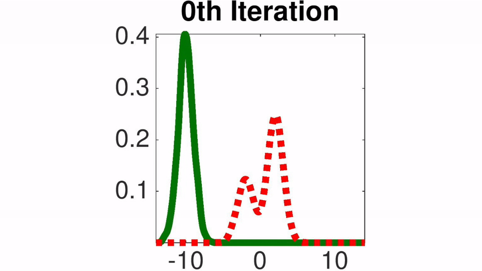

# Stein Variational Gradient Descent (SVGD)
SVGD is a general purpose variational inference algorithm that forms a natural counterpart of gradient descent for optimization. SVGD iteratively transports a set of particles to match with the target distribution, by applying a form of functional gradient descent that minimizes the KL divergence.

The package contains implementation of SVGD in both Matlab and Python language. Demos are also provided to reproduce the results in our paper. The Bayesian neural network example is based on [Theano](http://deeplearning.net/software/theano/).

For more information, please visit our project website - [SVGD](http://www.cs.dartmouth.edu/~dartml/project.html?p=vgd).

## Toy example on 1D Gaussian Mixture
Toy example with 1D Gaussian mixture. The red dashed lines are the target density function and the solid green lines are the densities of the particles at different iterations of our algorithm (estimated using kernel density estimator).



## Basic Usage
```python
'''
  x0: initial particles
  dlnprob: returns first order derivative of log probability
  n_iter: number of iterations
  stepsize: initial learning rate 
'''
theta = SVGD().update(x0, dlnprob, n_iter, stepsize)
```

## Citation
Qiang Liu and Dilin Wang. [Stein Variational Gradient Descent (SVGD): A General Purpose Bayesian Inference Algorithm](http://arxiv.org/abs/1608.04471). NIPS, 2016.

## Feedback
Feedback is greatly appreciated. If you have any questions, comments, issues or anything else really, [shoot me an email](mailto:dilin.wang.gr@dartmouth.edu).

All rights reserved.
=======
# draw

TensorFlow implementation of [DRAW: A Recurrent Neural Network For Image Generation](http://arxiv.org/pdf/1502.04623.pdf) on the MNIST generation task.

| With Attention  | Without Attention |
| ------------- | ------------- |
|  |  |

Although open-source implementations of this paper already exist (see links below), this implementation focuses on simplicity and ease of understanding. I tried to make the code resemble the raw equations as closely as posible.

For a gentle walkthrough through the paper and implementation, see the writeup here: [http://blog.evjang.com/2016/06/understanding-and-implementing.html](http://blog.evjang.com/2016/06/understanding-and-implementing.html).

## Usage

`python draw.py --data_dir=/tmp/draw` downloads the binarized MNIST dataset to /tmp/draw/mnist and trains the DRAW model with attention enabled for both reading and writing. After training, output data is written to `/tmp/draw/draw_data.npy`

You can visualize the results by running the script `python plot_data.py <prefix> <output_data>`

For example, 

`python myattn /tmp/draw/draw_data.npy`

To run training without attention, do:

`python draw.py --working_dir=/tmp/draw --read_attn=False --write_attn=False`

## Restoring from Pre-trained Model

Instead of training from scratch, you can load pre-trained weights by uncommenting the following line in `draw.py` and editing the path to your checkpoint file as needed. Save electricity! 

```python
saver.restore(sess, "/tmp/draw/drawmodel.ckpt")
```

This git repository contains the following pre-trained in the `data/` folder:

| Filename  | Description |
| ------------- | ------------- |
| draw_data_attn.npy | Training outputs for DRAW with attention |
| drawmodel_attn.ckpt | Saved weights for DRAW with attention |
| draw_data_noattn.npy | Training outputs for DRAW without attention |
| drawmodel_noattn.ckpt | Saved weights for DRAW without attention |

These were trained for 10000 iterations with minibatch size=100 on a GTX 970 GPU.

## Useful Resources

- https://github.com/vivanov879/draw
- https://github.com/jbornschein/draw
- https://github.com/ikostrikov/TensorFlow-VAE-GAN-DRAW (wish I had found this earlier)
- [Video Lecture on Variational Autoencoders and Image Generation]( https://www.youtube.com/watch?v=P78QYjWh5sM&list=PLE6Wd9FR--EfW8dtjAuPoTuPcqmOV53Fu&index=3)

